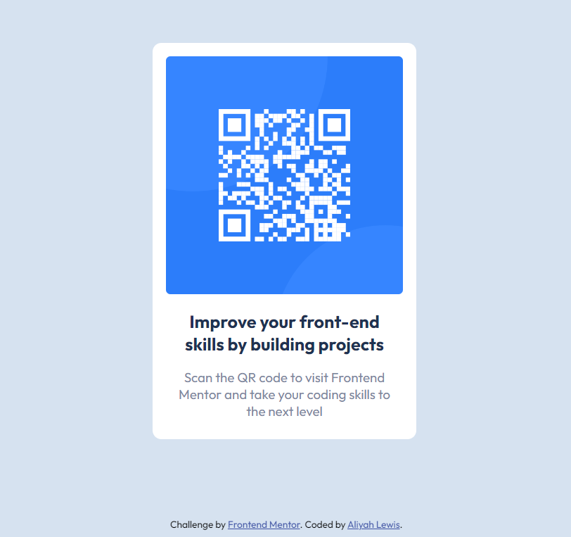

# Frontend Mentor - QR code component solution

This is a solution to the [QR code component challenge on Frontend Mentor](https://www.frontendmentor.io/challenges/qr-code-component-iux_sIO_H). Frontend Mentor challenges help you improve your coding skills by building realistic projects. 

## Table of contents

- [Overview](#overview)
  - [Screenshot](#screenshot)
  - [Link](#link)
- [My process](#my-process)
  - [Built with](#built-with)
  - [What I learned](#what-i-learned)
  - [Continued development](#continued-development)
  - [Useful resources](#useful-resources)
- [Author](#author)
- [Acknowledgments](#acknowledgments)

## Overview

### Screenshot



Here is my solution to the "QR Code Component" project on Frontend Mentor.

### Link

- Solution URL: [GitHub Qr Code Link](https://3osmic.github.io/QR-Code-Component/qr-code-component-main/)

## My process

### Built with

- Semantic HTML5 markup
- CSS custom properties
- Flexbox

#### HTML
- Meta tags for character set and viewport settings 
- Linking external stylesheets (styles.css)
- Usage of semantic tags like `html`, `head`, `meta`, `link`, `title`, `body`, `div`, `img`, `a`

#### CSS
- Resetting default styles using the * selector.
- Styling the body with flex properties to center content.
- Setting a background color and font family for the body.
- Styling the img tag for width and border-radius.
- Utilizing classes (image-container, content-container, p1, p2, attribution) for styling specific elements.
- Applying various styles for colors, padding, positioning, and typography.

### What I learned

When it came to the HTML aspect of the project, I was able to learn new shortcuts to adding class names in divider elements. Below is an example of how I did it:

```html
div.example-class
```
I hit tab space and it automatically created a class with the given name "example-class".

When it came to the CSS aspect of the project, I was able to learn a multitude of things. I'll first begin with setting all of the styling on the webpage to default values. This allows for clean and seamless code to appear on the webpage without any conflicts. Below is an example of this:
```css
* {
    margin: 0;
    padding: 0;
    border: 0;
    outline: none;
    box-sizing: border-box;
}
```
Secondly, I would like to include my ability to learn the importance of being organized. If I wanted to add styling to mainly the content of the container, then I would have a designated class for that section of the file.
```css
.content-container {
  align-items: center;
  padding: 15px 20px;
}
```
The last thing I was able to learn was the importance of padding and how it affects the positioning of content on one's webpage. Below is a provided example of the image-container I included in my project. This css code tells the webpage that there will be a centered main white container that encapsulates all provided information.
```css
.image-container {
    text-align: center;
    position: relative;
    width: 300px;
    height: 450px;
    background-color: white;
    padding: 15px 0px;
    overflow: hidden;
    border-radius: 10px;
}
```

### Continued development

I want to continue focusing on my css syntax more and how to style content on my webpage better. For that reason, the below are some content stylers that I will be honing in on.

- Padding
- Margin
- Flex Box
- Overflow
- Positioning

Once I'm able to understand the basic concepts of this, I can move on to more complex styling syntax.

### Useful resources

- [W3 Schools HTML](https://www.w3schools.com/html/) - This helped me learn the basic syntax for HTML. Whenever I need a refresher, I will use this website.
- [W3 Schools CSS](https://www.w3schools.com/css/) - This is the same website company but with a different tutorial for CSS. I recommend using this when you're just starting out styling. It really helped me learn some of the syntax in css as well. It also provided examples of how the code will look on elements afterwards.

## Author

- Frontend Mentor - [@3osmic](https://www.frontendmentor.io/profile/3osmic)

- LinkedIn - [Aliyah Lewis](https://www.linkedin.com/in/aliyah-lewis-14a95324b/)

## Acknowledgments
I would like to include a link to this video that was posted on youtube. It helped me a lot when I was trying to figure out how to write responsive web pages in html, css, and javascript.

Video: [Click me!](https://youtu.be/iILFBGm_I9M?si=RNUhVCZezwyYUOHS)
